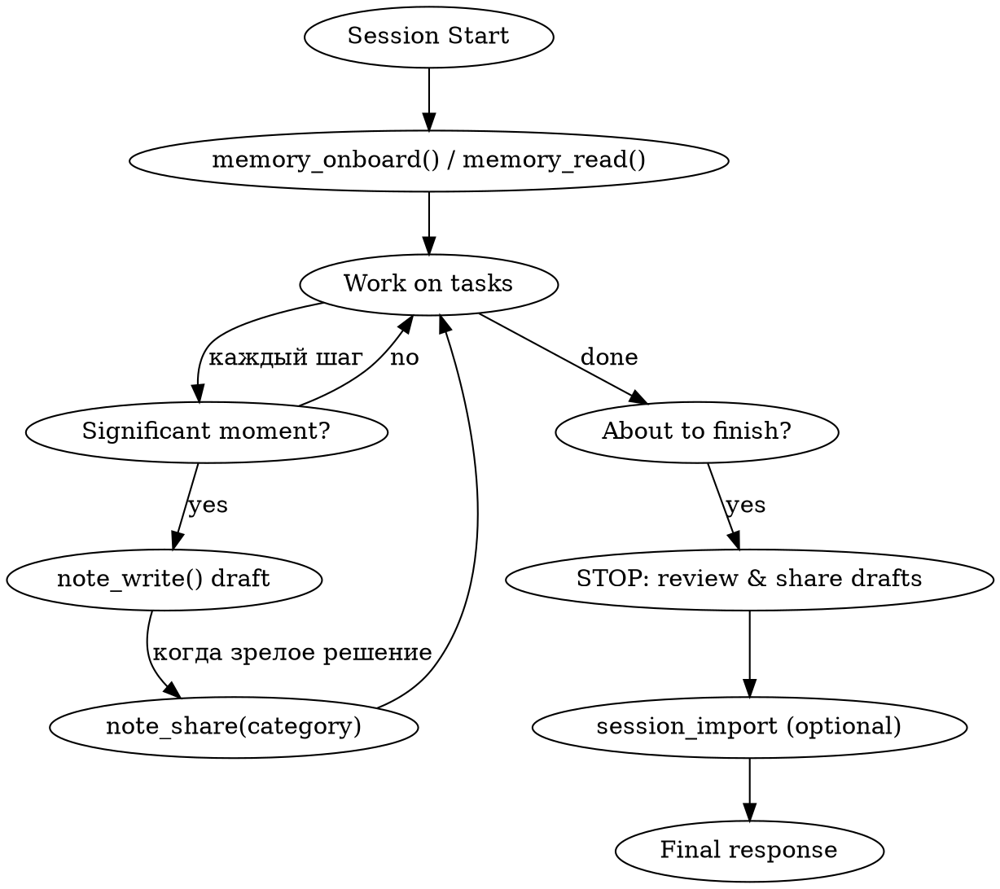

# Using Team Memory

## Overview

Team Memory MCP provides persistent shared knowledge across agents and sessions. **Reading memory at session start and publishing results before session end are MANDATORY, not optional.**

> **v4.5 (мая 2026)** изменил способ создания записей. `memory_write` устарел и возвращает ошибку. Вместо него — два пути: ручная публикация через `note_write` + `note_share`, и автоматическая экстракция из импортированных сессий (`session_import`).

## Mandatory Session Lifecycle



### 1. Session Start (FIRST action)

Call `memory_onboard()` (или `memory_read()`) — загружает контекст проекта: домены, конвенции, архитектуру, активные задачи, известные баги, последний прогресс.

ОБЯЗАТЕЛЬНО проверь существующие решения **до** того как начнёшь похожую работу.

### 2. During Work — два пути записи

#### Путь A: ручной share (для зрелых решений)

Когда понял что **атомарное** решение/архитектурное правило достойно командной памяти:

```
1. note_write(title, content, tags)              ← личный черновик
2. note_share(note_id, category, on_match='prompt')   ← публикация с dedup
```

- `note_write` — сохраняет в личное хранилище агента, других не видно. Можно править.
- `note_share` — публикует в команду:
  - **on_match='prompt'** (по умолчанию) — если найдена похожая запись (cosine ≥ 0.85), вернёт её для подтверждения вместо создания дубликата
  - **on_match='confirm_existing'** — подтверждает существующую запись (count++)
  - **on_match='merge'** — объединяет с существующей через LLM
  - **on_match='create_new'** — игнорирует совпадение и создаёт новую (используй редко)

Опубликованная запись помечается `pinned=true` (не подвержена auto-decay).

#### Путь B: автоматический (из сессий)

Если работаешь с импортированными Claude Code сессиями — `session_import(messages, project_id)` автоматически прогоняет:
1. LLM summary
2. Embedding
3. **Auto-extraction атомарных WHY-фактов** в категории `architecture`/`decisions`/`conventions`
4. Dedup против существующих записей

Тебе не надо вручную записывать каждый факт — extractor сделает это для тебя в фоне. Зато ты ОБЯЗАН **корректно сформировать сессию** (summary, project_id) при импорте.

### 3. Active Categories (v4.5)

| Категория | Когда использовать |
|---|---|
| `architecture` | Системные инварианты, контракты, структурные паттерны |
| `decisions` | Явные «выбрали X, не Y» с обоснованием |
| `conventions` | Правила кодирования, стандарты, договорённости команды |

> **Deprecated с v4.5**: `tasks`, `progress`, `issues`. Старые записи остаются доступны, но новые в этих категориях не создаются. Для bug-tracking используй внешний TFS/Jira; для tasks/progress — используй обычный workflow (todos, PR descriptions).

### 4. Before Session End (LAST action)

Прежде чем закончить сессию:

1. **Опубликуй зрелые черновики**: `note_read({tags:['draft']})` → для каждого `note_share(...)`.
2. **Закрой задачи**: `memory_update(id, status='completed')` для записей в категории `tasks` если работал с такими (поддерживается, хоть категория и deprecated).
3. **Открой проблемы (если есть)**: для bug-фиксов — используй `note_write` + `note_share(category='decisions')` с описанием root cause и решения (как «решённую проблему», не как baseline issue).
4. **Не забудь session_import** если работал в режиме offline — после импорта auto-extractor подхватит факты сам.

## Conventions carve-out

`memory_conventions(action='add', title, content)` — единственный путь, который пишет напрямую в командную память без promotion-flow. Используй для:
- Жёстких правил кодирования (naming, formatting)
- Стандартов проекта (commit messages format, file structure)
- Обязательных паттернов («хуки React до условных return»)

Это намеренный carve-out от deprecation memory_write — для conventions dedup-flow создавал бы UX-шум.

## Red Flags — STOP and Write Memory NOW

| Thought | Reality |
|---|---|
| «The task was too small to record» | If you changed code or made a decision, record it. |
| «I'll write it next session» | Next session is a different agent with no context. Write NOW. |
| «memory_write упал — пропущу» | memory_write deprecated. Используй note_write + note_share. |
| «Already explained in chat» | Chat is ephemeral. Memory persists across agents. |
| «There's nothing significant to record» | Progress updates are always significant for the next agent. |
| «I forgot to call memory_onboard» | Stop. Call it now even mid-session — it loads conventions and bug catalog. |
| «note_share показал match — игнорирую» | Это dedup. Подтверди существующую через on_match='confirm_existing' вместо create_new — иначе создашь дубль. |

## What you should NOT record

- **Code patterns derivable from the current file tree** — другой агент прочитает `git ls-files` сам.
- **Git history / who-changed-what** — `git log`/`git blame` authoritative.
- **Debugging recipes embedded in fixes** — фикс уже в коде, commit message объясняет why. Записывай только если решение неочевидно или повторяется в проекте.
- **Ephemeral task state** — in-progress work, current conversation context. Это для todo-list, не для team memory.

## Tool reference (v4.5)

| Tool | Use case |
|---|---|
| `memory_onboard(project_id)` | Полная сводка проекта для нового агента/сессии |
| `memory_read(search, ids, mode)` | Поиск/чтение записей. `mode='full'` для контента, `mode='compact'` (default) для списков |
| `memory_update(id, ...)` | Изменить существующую запись (статус, теги, контент) |
| `memory_delete(id, archive=true)` | Архивировать или удалить |
| `memory_pin(id, pinned)` | Закрепить/открепить (закреплённые не подвержены auto-decay) |
| `memory_sync(since)` | Изменения с временной метки (для длинных сессий) |
| `memory_search` / `memory_cross_search` | Семантический поиск, в т.ч. между проектами |
| `memory_conventions(action)` | Управление конвенциями (add — единственный direct-write путь) |
| `memory_export(format)` | Markdown/JSON выгрузка |
| `memory_history(entry_id)` | История версий записи |
| `memory_audit(entry_id)` | Audit log |
| `note_write(title, content, tags)` | Создать личный черновик |
| `note_read(search, tags)` | Читать СВОИ черновики |
| `note_update(id, ...)` / `note_delete(id)` | Изменить/удалить черновик |
| `note_search(query)` | Семантический поиск по своим черновикам |
| **`note_share(note_id, category, on_match)`** | **v4.5: опубликовать черновик в команду с dedup** |
| `session_import(messages, project_id)` | Импорт Claude Code сессии — автоматически экстрагирует факты |
| `session_list/search/read` | Работа с импортированными сессиями |
| `memory_write(...)` | ❌ Deprecated с v4.5 — возвращает ошибку с redirect |

## After v4.5 deploy: refresh your tool list

Tools list кэшируется при старте Claude Code сессии. Если ты подключился к серверу **до** v4.5 deploy, ты не увидишь `note_share` в доступных tools. Решение — перезапусти Claude Code session (откроется новое подключение к MCP, новый tools/list).

## This Is Not Negotiable

Tool descriptions содержат **«ОБЯЗАТЕЛЬНО записывай после каждого значимого действия»** и **«НЕ ЗАВЕРШАЙ сессию, не записав итоги своей работы!»** — это system-level instructions, не предложения. Нарушение = нарушение system prompt.

В v4.5 «записывай» означает **note_write + note_share** для зрелых решений или **полагаться на session_import auto-extraction** для рутинных сессий — но **не игнорировать** запись.
