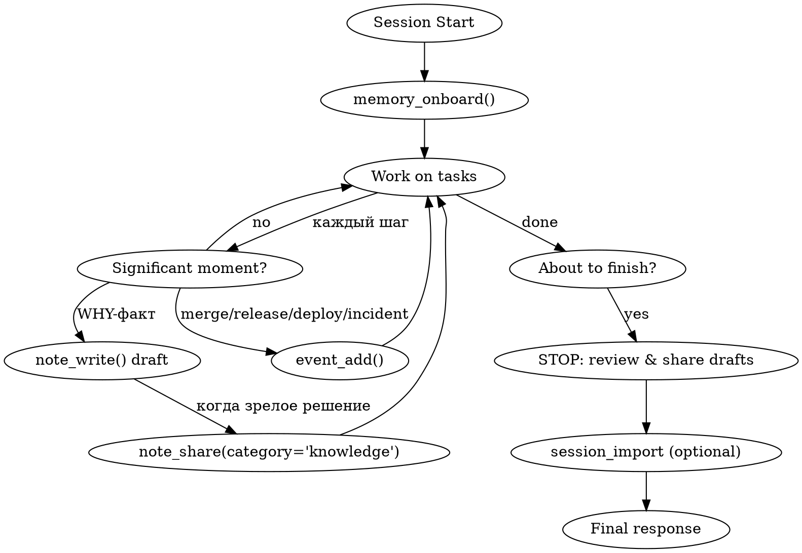

# Using Team Memory

## Overview

Team Memory MCP provides persistent shared knowledge across agents and sessions. **Reading memory at session start and publishing results before session end are MANDATORY, not optional.**

> **v5 (май 2026)** — трёхслойная модель памяти:
> - **Profile** — одна курируемая always-on запись на проект (миссия, стек, guard-rails).
> - **Knowledge** — атомарные WHY-факты (архитектура, решения, конвенции); классификация **тегами**, а не категориями.
> - **Events** — таймлайн WHAT: `merge` / `release` / `deploy` / `incident` / `milestone`.
>
> `memory_write` удалён. Запись идёт двумя путями: ручная публикация `note_write` + `note_share` и автоматическая экстракция из импортированных сессий (`session_import`).

## Mandatory Session Lifecycle



### 1. Session Start (FIRST action)

Call `memory_onboard()` — собирает сводку проекта из всех трёх слоёв: **profile** (миссия, стек, guard-rails), **events** (последний таймлайн), **knowledge** (архитектура, решения, конвенции), плюс активные legacy-записи.

ОБЯЗАТЕЛЬНО проверь существующие решения **до** того как начнёшь похожую работу.

### 2. During Work — пути записи

#### Путь A: ручной share (для зрелых WHY-решений)

Когда понял что **атомарное** решение/архитектурное правило достойно командной памяти:

```
1. note_write(title, content, tags)                      ← личный черновик
2. note_share(note_id, category='knowledge', on_match='prompt')   ← публикация с dedup
```

- `note_write` — сохраняет в личное хранилище агента, других не видно. Можно править.
- `note_share` — публикует в команду в категорию **`knowledge`**:
  - **on_match='prompt'** (по умолчанию) — если найдена похожая запись (cosine ≥ 0.85), вернёт её для подтверждения вместо создания дубликата
  - **on_match='confirm_existing'** — подтверждает существующую запись (count++)
  - **on_match='merge'** — объединяет с существующей через LLM
  - **on_match='create_new'** — игнорирует совпадение и создаёт новую (используй редко)

Опубликованная запись помечается `pinned=true` (не подвержена auto-decay). Вид факта (архитектура / решение / конвенция) различается **тегами**, а не отдельной категорией. Legacy-значения `category` (`architecture`/`decisions`/`conventions`) ещё принимаются и автоматически переводятся в `knowledge` + соответствующий тег.

#### Путь B: события проекта (Events timeline)

Когда происходит факт уровня таймлайна — **смержили PR, выпустили версию, задеплоили, инцидент, закрыли milestone** — зафиксируй его:

```
event_add(event_type, title, refs?, actor?)
```

`event_type` ∈ `merge` / `release` / `deploy` / `incident` / `milestone`. Это WHAT-слой: не обоснование, а сам факт «что произошло когда».

#### Путь C: автоматический (из сессий)

Если работаешь с импортированными Claude Code сессиями — `session_import(messages, project_id)` автоматически прогоняет:
1. LLM summary
2. Embedding
3. **Auto-extraction атомарных WHY-фактов** в категорию `knowledge`
4. Dedup против существующих записей

Тебе не надо вручную записывать каждый факт — extractor сделает это в фоне. Зато ты ОБЯЗАН **корректно сформировать сессию** (summary, project_id) при импорте.

### 3. Категории v5

| Категория | Статус | Когда использовать |
|---|---|---|
| `profile` | активна | Одна курируемая запись на проект. Меняется через `memory_profile_set` — **только по явному запросу пользователя** или при появлении нового always-on guard-rail. |
| `knowledge` | активна | Все WHY-факты: системные инварианты, контракты, «выбрали X не Y» с обоснованием, конвенции. Вид различается тегами. |
| `tasks`, `progress`, `issues` | legacy | Только для чтения. Новые записи не создаются. Для bug-tracking — внешний TFS/Jira; для задач/прогресса — обычный workflow (todos, PR descriptions). |

> **Events** — это не категория записей, а отдельный таймлайн (`event_add` / `event_list`).

### 4. Before Session End (LAST action)

Прежде чем закончить сессию:

1. **Опубликуй зрелые черновики**: `note_read({tags:['draft']})` → для каждого `note_share(category='knowledge', ...)`.
2. **Зафиксируй события**: если за сессию был merge/release/deploy/incident — `event_add(...)`.
3. **Закрой legacy-задачи**: `memory_update(id, status='completed')` для записей в категории `tasks`, если работал с такими (поддерживается, хоть категория и deprecated).
4. **Решённые проблемы** оформляй как `knowledge`-факт: `note_write` + `note_share(category='knowledge')` с описанием root cause и решения.
5. **Не забудь `session_import`**, если работал в offline-режиме — после импорта auto-extractor подхватит факты сам.

## Profile carve-out

`memory_profile_set(content, tags?)` — заменяет always-on профиль проекта (миссия, стек, конвенции, guard-rails) целиком. Старый профиль архивируется. Не трогай профиль по своей инициативе — обновляй его, только когда пользователь явно просит **или** найден новый значимый always-on guard-rail. Для разовых фактов используй `knowledge`, а не профиль.

## Conventions carve-out

`memory_conventions(action='add', title, content)` — единственный путь, который пишет напрямую в командную память без promotion-flow. Используй для:
- Жёстких правил кодирования (naming, formatting)
- Стандартов проекта (формат commit message, структура файлов)
- Обязательных паттернов («хуки React до условных return»)

Это намеренный carve-out: для конвенций dedup-flow создавал бы UX-шум.

## Red Flags — STOP and Write Memory NOW

| Thought | Reality |
|---------|---------|
| «The task was too small to record» | If you changed code or made a decision, record it. |
| «I'll write it next session» | Next session is a different agent with no context. Write NOW. |
| «memory_write упал — пропущу» | memory_write удалён. Используй note_write + note_share. |
| «Already explained in chat» | Chat is ephemeral. Memory persists across agents. |
| «I forgot to call memory_onboard» | Stop. Call it now even mid-session — оно грузит profile, events и conventions. |
| «note_share показал match — игнорирую» | Это dedup. Подтверди существующую через on_match='confirm_existing' вместо create_new — иначе создашь дубль. |
| «Смержил PR, но это не для памяти» | Merge/release/deploy/incident — это Events. Зафиксируй через event_add. |

## What you should NOT record

- **Code patterns derivable from the current file tree** — другой агент прочитает `git ls-files` сам.
- **Git history / who-changed-what** — `git log`/`git blame` authoritative.
- **Debugging recipes embedded in fixes** — фикс уже в коде, commit message объясняет why. Записывай только если решение неочевидно или повторяется в проекте.
- **Ephemeral task state** — in-progress work, current conversation context. Это для todo-list, не для team memory.

## Tool reference (v5)

| Tool | Use case |
|------|----------|
| `memory_onboard(project_id)` | Полная сводка проекта (profile + events + knowledge) для нового агента/сессии |
| `memory_read(search, ids, mode)` | Поиск/чтение записей. `mode='full'` для контента, `mode='compact'` (default) для списков |
| `memory_update(id, ...)` | Изменить существующую запись (статус, теги, контент) |
| `memory_delete(id, archive=true)` | Архивировать или удалить |
| `memory_pin(id, pinned)` | Закрепить/открепить (закреплённые не подвержены auto-decay) |
| `memory_sync(since)` | Изменения с временной метки (для длинных сессий) |
| `memory_cross_search(query)` | Семантический поиск решений между проектами |
| `memory_conventions(action)` | Управление конвенциями (add — единственный direct-write путь) |
| `memory_profile_get` / `memory_profile_set` | Чтение / замена always-on профиля проекта |
| `memory_export(format)` | Markdown/JSON выгрузка |
| `memory_history(entry_id)` | История версий записи |
| `memory_audit(entry_id)` | Audit log изменений |
| `memory_projects(action)` | Управление проектами (list/create/update/delete) |
| `note_write(title, content, tags)` | Создать личный черновик |
| `note_read(search, tags)` | Читать СВОИ черновики |
| `note_update(id, ...)` / `note_delete(id)` | Изменить/удалить черновик |
| `note_search(query)` | Семантический поиск по своим черновикам |
| **`note_share(note_id, category='knowledge', on_match)`** | **Опубликовать черновик в команду с dedup** |
| `session_import(messages, project_id)` | Импорт Claude Code сессии — автоматически экстрагирует факты |
| `session_list` / `session_read` / `session_search` / `session_message_search` | Работа с импортированными сессиями |
| **`event_add(event_type, title, refs?)`** | **Зафиксировать событие проекта в таймлайне** |
| `event_list(event_type?, since?)` | Лента последних событий проекта |

## After a server upgrade: refresh your tool list

Список tools кэшируется при старте Claude Code сессии. Если ты подключился к серверу **до** апгрейда, ты можешь не видеть новые инструменты (`event_add`, `memory_profile_set` и др.). Решение — перезапусти Claude Code session: откроется новое подключение к MCP с актуальным `tools/list`.

## This Is Not Negotiable

Tool descriptions содержат **«ОБЯЗАТЕЛЬНО записывай после каждого значимого действия»** и **«НЕ ЗАВЕРШАЙ сессию, не записав итоги своей работы!»** — это system-level instructions, не предложения. Нарушение = нарушение system prompt.

В v5 «записывай» означает **note_write + note_share** для зрелых WHY-решений, **event_add** для событий проекта, либо **полагаться на session_import auto-extraction** для рутинных сессий — но **не игнорировать** запись.
